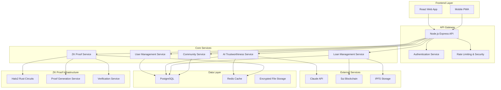

# Design Document

## Overview

The Community P2P Lending Platform is a privacy-preserving, AI-powered lending service designed for small communities. The system combines advanced cryptographic techniques (Halo2 zero-knowledge proofs), blockchain technology (Sui), and artificial intelligence (Claude NLP) to create a trustworthy, inclusive, and secure lending environment.

### Key Design Principles

- **Privacy by Design**: Zero-knowledge proofs ensure sensitive data never leaves user control
- **Community-Centric**: Tailored for small community dynamics and social trust networks
- **Bias-Free AI**: Ethical AI implementation with continuous bias monitoring and mitigation
- **Regulatory Compliance**: Built-in GDPR compliance and financial regulation adherence
- **Inclusive Access**: Alternative creditworthiness assessment for underbanked populations

## Architecture

### High-Level System Architecture



### Service Architecture Patterns

- **Microservices Architecture**: Each core service operates independently with well-defined APIs
- **Event-Driven Communication**: Services communicate through event streams for loose coupling
- **CQRS Pattern**: Separate read and write models for optimal performance and scalability
- **Circuit Breaker Pattern**: Fault tolerance for external service dependencies

## Components and Interfaces

### 1. Frontend Components (React)

#### Core Components
- **UserDashboard**: Main interface showing loan status, community activity, and trustworthiness score
- **LoanRequestForm**: Guided form for creating loan requests with privacy controls
- **LenderInterface**: Browse and evaluate loan opportunities with AI insights
- **CommunityHub**: Social features for community interaction and reputation building
- **PrivacyCenter**: GDPR compliance tools for data management and consent

#### Key Features
- Progressive Web App (PWA) for mobile-first experience
- Responsive design optimized for various screen sizes
- Accessibility compliance (WCAG 2.1 AA)
- Multi-language support for community inclusion

### 2. API Gateway (Node.js Express)

#### Authentication & Authorization
```javascript
// JWT-based authentication with refresh tokens
interface AuthToken {
  userId: string;
  communityId: string;
  permissions: string[];
  zkProofStatus: boolean;
}
```

#### Rate Limiting & Security
- API rate limiting per user and endpoint
- Request validation and sanitization
- CORS configuration for frontend domains
- Security headers and HTTPS enforcement

### 3. AI Trustworthiness Service

#### Claude Integration Architecture
```javascript
// Service interface for personality analysis
interface PersonalityAnalysisService {
  analyzeMessageHistory(messages: string[]): Promise<BigFiveTraits>;
  calculateTrustworthiness(traits: BigFiveTraits): Promise<TrustScore>;
  explainScore(score: TrustScore): Promise<ScoreExplanation>;
}

interface BigFiveTraits {
  conscientiousness: number; // 0-100, weight: 40%
  neuroticism: number;       // 0-100, weight: 25% (inverse)
  agreeableness: number;     // 0-100, weight: 20%
  openness: number;          // 0-100, weight: 10%
  extraversion: number;      // 0-100, weight: 5%
  confidence: number;        // Overall confidence in analysis
}
```

#### Bias Mitigation Framework
- Demographic parity monitoring across protected classes
- Equalized odds validation for lending decisions
- Continuous model retraining with fairness constraints
- Audit trail for all AI decisions and bias corrections

### 4. Zero-Knowledge Proof Service (Halo2 + Rust)

#### Circuit Design
```rust
// Halo2 circuit for trustworthiness threshold proof
#[derive(Clone)]
struct TrustScoreCircuit {
    trust_score: Option<u64>,    // Private input
    threshold: u64,              // Public input (70)
    is_above_threshold: Option<bool>, // Public output
}

impl Circuit<Fp> for TrustScoreCircuit {
    // Circuit implementation proving score > threshold
    // without revealing actual score
}
```

#### FFI Interface for Node.js
```rust
// C-compatible interface for Node.js integration
#[no_mangle]
pub extern "C" fn generate_trust_proof(
    score: u64,
    threshold: u64,
) -> *mut ProofResult;

#[no_mangle]
pub extern "C" fn verify_trust_proof(
    proof: *const u8,
    proof_len: usize,
) -> bool;
```

#### Proof Types
- **Trust Score Proofs**: Prove score above threshold without revealing score
- **Income Range Proofs**: Prove income within range without exact amount
- **Identity Proofs**: Verify identity attributes without exposing PII
- **Loan History Proofs**: Prove repayment history without transaction details

### 5. Sui Blockchain Integration

#### Smart Contract Architecture
```move
// Sui Move contract for loan management
module lending_platform::loan_manager {
    struct Loan has key, store {
        id: UID,
        borrower: address,
        lender: address,
        amount: u64,
        interest_rate: u64,
        duration: u64,
        zk_proof_hash: vector<u8>,
        status: u8, // 0: pending, 1: active, 2: completed, 3: defaulted
        encrypted_details: vector<u8>,
    }
    
    public fun create_loan_with_proof(
        borrower: address,
        amount: u64,
        zk_proof: vector<u8>,
        ctx: &mut TxContext
    ): Loan;
}
```

#### Privacy-Preserving Features
- Encrypted loan details stored on-chain
- ZK proof verification before loan creation
- Private payment channels for loan servicing
- Confidential transaction amounts using Sui's privacy features

### 6. Community Management Service

#### Community Structure
```typescript
interface Community {
  id: string;
  name: string;
  description: string;
  memberCount: number;
  trustNetwork: TrustNetwork;
  lendingRules: LendingRules;
  governanceModel: GovernanceModel;
}

interface TrustNetwork {
  connections: Map<string, TrustConnection>;
  reputationScores: Map<string, number>;
  endorsements: Endorsement[];
}
```

## Data Models

### 1. User Data Model
```typescript
interface User {
  id: string;
  email: string;
  profile: UserProfile;
  communityMemberships: CommunityMembership[];
  trustworthinessScore: TrustScore;
  zkProofStatus: ZKProofStatus;
  gdprConsent: GDPRConsent;
  createdAt: Date;
  updatedAt: Date;
}

interface UserProfile {
  firstName: string;
  lastName: string;
  dateOfBirth?: Date; // Optional, encrypted
  location: Location;
  languages: string[];
  digitalLiteracyLevel: number;
}
```

### 2. Loan Data Model
```typescript
interface Loan {
  id: string;
  borrowerId: string;
  lenderId?: string;
  communityId: string;
  amount: number;
  interestRate: number;
  duration: number; // in days
  purpose: string;
  status: LoanStatus;
  zkProofHash: string;
  suiTransactionId: string;
  repaymentSchedule: RepaymentSchedule;
  createdAt: Date;
  updatedAt: Date;
}

enum LoanStatus {
  PENDING = 'pending',
  FUNDED = 'funded',
  ACTIVE = 'active',
  COMPLETED = 'completed',
  DEFAULTED = 'defaulted',
  DISPUTED = 'disputed'
}
```

### 3. AI Analysis Data Model
```typescript
interface AIAnalysis {
  id: string;
  userId: string;
  messageHistoryHash: string; // Hash of analyzed content
  bigFiveTraits: BigFiveTraits;
  trustworthinessScore: number;
  confidenceLevel: number;
  biasFlags: BiasFlag[];
  analysisDate: Date;
  modelVersion: string;
}

interface BiasFlag {
  type: string;
  severity: 'low' | 'medium' | 'high';
  description: string;
  mitigationApplied: boolean;
}
```

### 4. ZK Proof Data Model
```typescript
interface ZKProof {
  id: string;
  userId: string;
  proofType: ProofType;
  proofData: Uint8Array;
  publicInputs: any[];
  verificationStatus: boolean;
  circuitVersion: string;
  generatedAt: Date;
  expiresAt: Date;
}

enum ProofType {
  TRUST_SCORE = 'trust_score',
  INCOME_RANGE = 'income_range',
  IDENTITY = 'identity',
  LOAN_HISTORY = 'loan_history'
}
```

## Error Handling

### 1. API Error Handling Strategy
```typescript
interface APIError {
  code: string;
  message: string;
  details?: any;
  timestamp: Date;
  requestId: string;
}

// Standardized error codes
enum ErrorCodes {
  INVALID_ZK_PROOF = 'INVALID_ZK_PROOF',
  INSUFFICIENT_TRUST_SCORE = 'INSUFFICIENT_TRUST_SCORE',
  BLOCKCHAIN_TRANSACTION_FAILED = 'BLOCKCHAIN_TRANSACTION_FAILED',
  AI_ANALYSIS_FAILED = 'AI_ANALYSIS_FAILED',
  GDPR_COMPLIANCE_ERROR = 'GDPR_COMPLIANCE_ERROR'
}
```

### 2. Blockchain Error Handling
- Transaction retry mechanisms with exponential backoff
- Fallback to alternative blockchain networks if available
- Graceful degradation when blockchain is unavailable
- User notification system for transaction status

### 3. AI Service Error Handling
- Fallback to alternative trustworthiness assessment methods
- Graceful handling of Claude API rate limits and failures
- Bias detection failure protocols
- Model version rollback capabilities

### 4. ZK Proof Error Handling
- Circuit compilation error recovery
- Proof generation timeout handling
- Verification failure explanations
- Alternative verification methods when ZK proofs fail

## Testing Strategy

### 1. Unit Testing
- **Frontend**: Jest + React Testing Library for component testing
- **Backend**: Jest + Supertest for API endpoint testing
- **Rust ZK Circuits**: Rust native testing framework with property-based testing
- **Smart Contracts**: Sui testing framework for Move contracts

### 2. Integration Testing
- API integration tests with mock external services
- Database integration tests with test containers
- Blockchain integration tests with local Sui network
- ZK proof integration tests with FFI bindings

### 3. End-to-End Testing
- Cypress for full user journey testing
- Automated testing of loan creation to completion flow
- Privacy compliance testing scenarios
- Multi-community interaction testing

### 4. Security Testing
- Penetration testing for API endpoints
- ZK proof soundness and zero-knowledge property verification
- Smart contract security audits
- GDPR compliance testing

### 5. Performance Testing
- Load testing for concurrent users
- ZK proof generation performance benchmarks
- Blockchain transaction throughput testing
- AI analysis response time optimization

### 6. Bias and Fairness Testing
- Demographic parity testing across user groups
- Equalized odds validation for lending decisions
- Adversarial testing for bias detection
- Fairness metric monitoring in production

### 7. Automated Testing Hooks
- Pre-commit hooks for code quality and security checks
- Continuous integration pipeline with comprehensive test suite
- Automated ZK proof validity testing on circuit changes
- Blockchain integration testing on smart contract updates

## Security Considerations

### 1. Data Protection
- End-to-end encryption for sensitive user data
- Zero-knowledge architecture ensuring data never leaves user control
- Secure key management with hardware security modules
- Regular security audits and penetration testing

### 2. Smart Contract Security
- Formal verification of critical contract functions
- Multi-signature requirements for administrative functions
- Time-locked upgrades with community governance
- Bug bounty program for vulnerability discovery

### 3. AI Model Security
- Adversarial attack resistance testing
- Model poisoning prevention mechanisms
- Secure model serving infrastructure
- Privacy-preserving model updates

### 4. Infrastructure Security
- Container security with minimal attack surface
- Network segmentation and firewall rules
- Intrusion detection and response systems
- Regular security updates and patch management